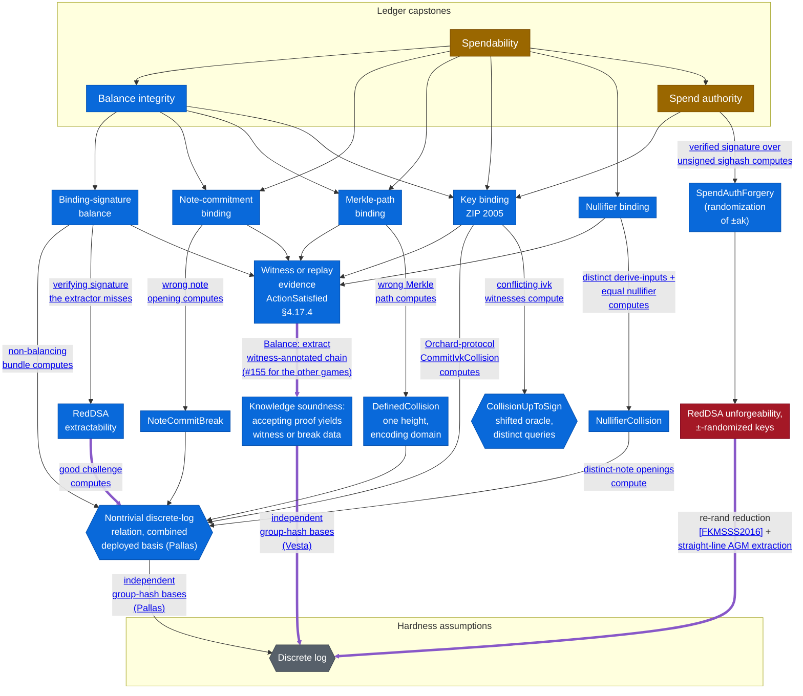

# Ledger Security Games

The [proof map](proof-map.md) traces *verifier knowledge soundness* — the deployed Halo 2 verifier
under `Zcash/Snark/`. This page is its companion for the other half of the development: the
protocol **security properties** under `Zcash/Security/`. It covers:
* the top-level capstones — the *ledger-model security games* of *Balance integrity*
  (`orchardBalanceIntegrityExtraction_measure_le_of_dlogProfiles`), *Spendability*
  (`faerieGoldCore`, `validLedger_append`), and *Spend authority*
  (`orchardSpendAuthority_measure_le`);
* how each capstone connects, by reduction via intermediate security properties such as
  *binding-signature balance* and *key binding*, to an exhibited break of a cryptographic
  primitive in a specified adversary model — and where the intended hand-off to *verifier
  knowledge soundness* remains open.

Every argument here follows the *breaks as computed data* convention and the three-layer
stack described in [Security Models](security-models.md).

## One picture, not yet connected

➞ heavy purple edge: a reduction (or intended reduction) in the AGM+RO — the adversary is <a href="security-models.html#the-algebraic-adversary-restriction">algebraic</a> and the challenge oracle is a random oracle that the reduction may program 
➝ thin edge: depends on (a reduction, assumption, or model) 
 ■  fully proven — nothing here yet 
 ■  stated and machine-checked in Lean, over abstract primitives 
 ■  partly machine-checked; remainder tracked (discharging the capstones' named ε's end to end; the effect of undischarged RedDSA unforgeability on the Spendability and Spend authority goals) 
 ■  named hypothesis; formalization deferred 
 ■  assumption; terminal by design 

This picture is a deliberate approximation, and is likely to change as the formalization
proceeds.

## What the Balance capstones assume

The composed Balance capstones are stated for a proof-emitting adversary
([`ExtractionBalanceAdversary`](https://github.com/zcash/ironwood/blob/main/Zcash/Security/Ledger/OrchardExtractionExperiment.lean)):
one that outputs a ledger whose Actions carry accepting proofs, with no witnesses
supplied. Knowledge soundness of the Action circuit enters through the extractor:
[`OrchardExtractionExperiment`](https://github.com/zcash/ironwood/blob/main/Zcash/Security/Ledger/OrchardExtractionExperiment.lean)
builds a *Knowledge-Soundness-idealized* adversary
([`IdealizedKSBalanceAdversary`](https://github.com/zcash/ironwood/blob/main/Zcash/Security/Ledger/OrchardIntegrityExperiment.lean))
—one whose every Action carries the witness for the Action statement— by annotating the
chain with the witnesses that the extractor computes from the sampled runs. Per bundle,
[`actionSpecToLedgerData`](https://github.com/zcash/ironwood/blob/main/Zcash/Security/Ledger/SinsemillaDLR.lean)
refines each extracted circuit witness to the games-facing ledger data or a computed
Sinsemilla break, and `bundleLedgerData` traverses the whole bundle. Each component
argument consumes the Action statement's satisfaction (`ActionSatisfied`) on the
annotated witness; in the model's replay case, the ledger oracle reproduces the
previously supplied witness. The composed endpoints bound the extraction-failure arm
together with the deployed violation events.
The `_idealizedks` endpoints remain, stated directly over that annotated model —their
names mark it— and the composed capstones consume them at the constructed adversary.

On the composed route to the Balance goals, the `_of_dlogProfiles` endpoints carry no
per-arm hypotheses at all. The knowledge arm is discharged by the adaptive-statement
capstone, applied once per slot-size pair, and every relation arm —the per-pair escapes,
the Sinsemilla reducer's relations, and the value-DLR finder's— is carried by the single
term `combinedDLRAdvantage`: one event over the composed deployed experiment, whose
samples all compute nontrivial relations over the combined deployed basis
(`orchardPoints`). The k·maxActions factor multiplies only the knowledge arm and is
tracked as [#214](https://github.com/zcash/ironwood/issues/214). The deployed forms
state validity at the deployed value bases: the value commitment is definitionally the
deployed one, with no reference-string step on the value side. Their accepted
trade-offs —the binding challenge hash as a random oracle, the per-size finite
presentation of the Fiat–Shamir oracle, and elided byte encodings— are documented at
`IdealizedKSBalanceAdversary.deployedViolationEvent`. For Spendability and Spend
Authority the annotations remain a modelling assumption: those games are not yet
composed with the circuit layer, and
[#155](https://github.com/zcash/ironwood/issues/155) tracks the oracle-machine layer
for their capstone slots.

Also open is RedDSA unforgeability. The RedDSA node is a named hypothesis rather than a
terminal assumption: its discharge edge names the reduction for security of signatures
with re-randomizable keys
([Efficient Unlinkable Sanitizable Signatures from Signatures with Re-Randomizable Keys](https://eprint.iacr.org/2015/395),
section 3), adapted to the ±-randomized variant, together with the same straight-line
AGM+ROM extraction of Fuchsbauer–Plouviez–Seurin
([Blind Schnorr Signatures and Signed ElGamal Encryption in the Algebraic Group Model](https://eprint.iacr.org/2019/877),
Theorem 1) that discharges the binding-signature extractability node at
$(q_H + 2)/\FieldSize + \varepsilon_{\mathrm{DL}}$. The two arms differ in the signing
oracle: the binding-signature extraction has none to simulate, because the signature
extracted from is the adversary's own, while the RedDSA unforgeability game has one.
The planned discharge is to simulate the signing oracle by programming the challenge
oracle at the re-randomized key; the randomizer, carried by the forgery, enters the
extraction as a known coefficient.

Every solid arrow reads "rests on"; where an edge carries a label, the label names the
computed break object flowing along it, or the side condition under which the reduction
holds (base independence from the group hash). Heavy purple arrows mark reductions (or
intended reductions) in the AGM+RO: both the source and the target of such an edge are
interpreted as games against online-AGM adversaries with the challenge oracle as a
programmable random oracle, so the model scopes the whole reduction rather than being
one more assumption it rests on — see
[Security Models](security-models.md#the-algebraic-adversary-restriction). The
`CollisionUpToSign` arm is terminal without any assumption — its bound is the
[birthday count](https://github.com/zcash/ironwood/blob/main/Zcash/Security/Common/Birthday.lean)
over the oracle table, a pure counting argument. It is the one purely random-oracle
reduction on this page, and it belongs to the ZIP 2005 recovery analysis rather than
the pre-quantum story. The games are the top-level capstones.

New to the shorthand? See the [**Definitions**](definitions.md). &nbsp;·&nbsp; For the methodology, [**Security Models**](security-models.md). &nbsp;·&nbsp; For the verifier-soundness half, the [**Proof Map**](proof-map.md).
