# Ledger Security Games

The [proof map](proof-map.md) traces *verifier knowledge soundness* — the deployed Halo 2 verifier
under `Zcash/Snark/`. This page is its companion for the other half of the development: the
protocol **security properties** under `Zcash/Security/`. It covers:
* the top-level capstones — the *ledger-model security games* of *Balance integrity*, *Spendability*, and *Spend authority*;
* how each capstone connects, by reduction via intermediate security properties such as
  *binding-signature balance* and *key binding*, to an exhibited break of a cryptographic
  primitive in a specified adversary model — including the proof-emitting Balance hand-off
  to *verifier knowledge soundness*, and the broader hand-offs that remain open.

Every argument here follows the *breaks as computed data* convention and the three-layer
stack described in [Security Models](security-models.md).

## One picture, partially connected

```mermaid
%%{init: {"flowchart": {"nodeSpacing": 20, "rankSpacing": 50, "padding": 6, "diagramPadding": 4, "subGraphTitleMargin": {"top": 4, "bottom": 18}}, "themeCSS": ".cluster-label { font-weight: 700; font-size: 1.1em; font-family: raleway, sans-serif; } marker { overflow: visible !important; } marker path { transform-box: fill-box !important; transform-origin: center !important; transform: scale(1.25) !important; }"}}%%
flowchart TD
  subgraph GAMES["Ledger capstones"]
    BAL["Balance integrity<br/>orchardBalanceIntegrity_measure_le"]
    SPEND["Spendability<br/>faerieGoldCore<br/>validLedger_append"]
    SPENDAUTH["Spend authority<br/>orchardSpendAuthority_measure_le"]
  end

  BAL --> BS["Binding-signature<br/>balance"]
  BAL --> NCB["Note-commitment<br/>binding"]
  BAL --> MERK["Merkle-path<br/>binding"]
  BAL --> KB["Key binding<br/>ZIP 2005"]
  SPEND --> BAL
  SPEND ---> NCB
  SPEND ---> MERK
  SPEND ---> KB
  SPEND ---> NFB["Nullifier binding"]
  SPEND ---> SPENDAUTH
  SPENDAUTH --> KB

  subgraph ASSUMPTIONS["Hardness assumptions"]
    DL[("Discrete log")]
  end

  subgraph MODELS["Heuristic adversary models"]
    ROM[("Random oracle")]
  end

  BS --->|"<a target='_blank' href='https://github.com/zcash/ironwood/blob/main/Zcash/Security/BindingSignature/Balance.lean'>non-balancing<br/>bundle computes</a>"| NDLR["NontrivialRelation<br/>(<span class='katex'><span class='mord mathcal'>V</span></span>,&nbsp;<span class='katex'><span class='mord mathcal'>R</span></span>) discrete-log<br/>relation"]
  BS --->|"<a target='_blank' href='https://github.com/zcash/ironwood/blob/main/Zcash/Security/Ledger/ExtractionArm.lean'>verifying signature<br/>the extractor misses</a>"| KERR["RedDSA<br/>extractability"]
  BS --> STMT["Witness or replay<br/>evidence<br/>ActionSatisfied<br/>§4.17.4"]
  NCB --->|"<a target='_blank' href='https://github.com/zcash/ironwood/blob/main/Zcash/Security/Ledger/Statement.lean'>wrong note<br/>opening computes</a>"| NCBK["NoteCommitBreak"]
  NCB --> STMT
  MERK --> STMT
  MERK --->|"<a target='_blank' href='https://github.com/zcash/ironwood/blob/main/Zcash/Security/Ledger/Merkle.lean'>wrong Merkle<br/>path computes</a>"| MC["DefinedCollision<br/>one height,<br/>encoding domain"]
  KB --> STMT
  KB --->|"<a target='_blank' href='https://github.com/zcash/ironwood/blob/main/Zcash/Security/Ledger/KeyBindingDLR.lean'>Orchard-protocol<br/>CommitIvkCollision<br/>computes</a>"| SDLR
  KB --->|"<a target='_blank' href='https://github.com/zcash/ironwood/blob/main/Zcash/Security/KeyBinding/Basic.lean'>conflicting ivk<br/>witnesses compute</a>"| CUS["CollisionUpToSign<br/>shifted oracle,<br/>distinct queries"]
  NFB --> STMT
  NFB --->|"<a target='_blank' href='https://github.com/zcash/ironwood/blob/main/Zcash/Security/Ledger/Spendability.lean'>distinct derive-inputs +<br/>equal nullifier<br/>computes</a>"| NFC["NullifierCollision"]
  SPENDAUTH --->|"<a target='_blank' href='https://github.com/zcash/ironwood/blob/main/Zcash/Security/Ledger/SpendAuthority.lean'>verified signature over<br/>unsigned sighash computes</a>"| SAF["SpendAuthForgery<br/>(randomization<br/>of ±ak)"]

  STMT STMTtoKS@-. "<a target='_blank' href='https://github.com/zcash/ironwood/issues/147'>intended hand-off:<br/>not yet formalized<br/>(#147, #155)</a>" .-> KS["Knowledge soundness:<br/>accepting proof yields<br/>witness or break data<br/>(separate development)"]
  NCBK --> SDLR["Sinsemilla<br/>discrete-log<br/>relation"]

  KERR KERRtoNDLR@==>|"<a target='_blank' href='https://github.com/zcash/ironwood/blob/main/Zcash/Security/RedDSA/Extraction.lean'>good challenge<br/>computes</a>"| NDLR
  KERR --->|"<a target='_blank' href='https://github.com/zcash/ironwood/blob/main/Zcash/Security/RedDSA/KnowledgeError.lean'>challenge hash as random<br/>oracle; query-time labels<br/>pin the bad challenge</a>"| ROM
  NDLR -->|"<a target='_blank' href='https://github.com/zcash/ironwood/blob/main/Zcash/Security/BindingSignature/DiscreteLog.lean'>independent<br/>hash-to-curve bases</a>"| DL
  SDLR -->|"<a target='_blank' href='https://github.com/zcash/ironwood/blob/main/Zcash/Security/BindingSignature/DiscreteLog.lean'>independent<br/>hash-to-curve bases</a>"| DL
  KS KStoDL@===>|"<a target='_blank' href='https://github.com/zcash/ironwood/blob/main/Zcash/Snark/Soundness/Action/AdaptiveStatementKnowledge.lean'>independent<br/>hash-to-curve bases</a>"| DL
  KS -->|"<a target='_blank' href='https://github.com/zcash/ironwood/tree/main/Zcash/Snark/Soundness/FiatShamir'>Fiat–Shamir<br/>heuristic</a>"| ROM
  MC --> SDLR
  CUS --->|"<a target='_blank' href='https://github.com/zcash/ironwood/blob/main/Zcash/Security/Common/Birthday.lean'>birthday counting<br/>q(q-1)/|𝔽|,<br/>no assumption</a>"| ROM
  NFC -->|"<a target='_blank' href='https://github.com/zcash/ironwood/blob/main/Zcash/Security/Ledger/Nullifier.lean'>distinct-note openings<br/>compute</a>"| SDLR
  SAF ---> RDSA["RedDSA unforgeability,<br/>±-randomized keys"]
  RDSA RDSAtoDL@==>|"re-rand reduction<br/><a target='_blank' href='https://eprint.iacr.org/2015/395'>[FKMSSS2016]</a> +<br/><a target='_blank' href='https://eprint.iacr.org/2019/877'>straight-line AGM extraction</a>"| DL
  RDSA -->|"challenge hash<br/>as random oracle"| ROM

  click BAL "https://github.com/zcash/ironwood/blob/main/Zcash/Security/Ledger/Balance.lean" _blank
  click SPEND "https://github.com/zcash/ironwood/blob/main/Zcash/Security/Ledger/Spendability.lean" _blank
  click SPENDAUTH "https://github.com/zcash/ironwood/blob/main/Zcash/Security/Ledger/SpendAuthority.lean" _blank
  click BS "https://github.com/zcash/ironwood/blob/main/Zcash/Security/BindingSignature/Balance.lean" _blank
  click NCB "https://github.com/zcash/ironwood/blob/main/Zcash/Security/Ledger/Statement.lean" _blank
  click MERK "https://github.com/zcash/ironwood/blob/main/Zcash/Security/Ledger/Merkle.lean" _blank
  click KB "https://github.com/zcash/ironwood/blob/main/Zcash/Security/KeyBinding/Basic.lean" _blank
  click NFB "https://github.com/zcash/ironwood/blob/main/Zcash/Security/Ledger/Spendability.lean" _blank
  click STMT "https://github.com/zcash/ironwood/blob/main/Zcash/Security/Ledger/Statement.lean" _blank
  click NCBK "https://github.com/zcash/ironwood/blob/main/Zcash/Security/Ledger/Statement.lean" _blank
  click MC "https://github.com/zcash/ironwood/blob/main/Zcash/Security/Ledger/Merkle.lean" _blank
  click CUS "https://github.com/zcash/ironwood/blob/main/Zcash/Security/Common/RandomOracle.lean" _blank
  click NFC "https://github.com/zcash/ironwood/blob/main/Zcash/Security/Ledger/Spendability.lean" _blank
  click SAF "https://github.com/zcash/ironwood/blob/main/Zcash/Security/Ledger/SpendAuthority.lean" _blank
  click NDLR "https://github.com/zcash/ironwood/blob/main/Zcash/Common/DiscreteLogRelation.lean" _blank
  click SDLR "https://github.com/zcash/ironwood/blob/main/Zcash/Common/DiscreteLogRelation.lean" _blank
  click KS "https://github.com/zcash/ironwood/blob/main/Zcash/Snark/Soundness/Relation/KnowledgeSoundness.lean" _blank
  click DL "https://github.com/zcash/ironwood/blob/main/Zcash/Common/DiscreteLogRelation.lean" _blank
  click ROM "https://github.com/zcash/ironwood/blob/main/Zcash/Security/Common/RandomOracle.lean" _blank
  click KERR "https://github.com/zcash/ironwood/blob/main/Zcash/Security/Ledger/ExtractionKnowledgeError.lean" _blank
  click RDSA "https://github.com/zcash/ironwood/issues/121" _blank

  classDef proven fill:#1a7f37,stroke:#116329,color:#ffffff
  classDef checked fill:#0969da,stroke:#0550ae,color:#ffffff
  classDef partial fill:#9a6700,stroke:#7d4e00,color:#ffffff
  classDef hyp fill:#cf222e,stroke:#a40e26,color:#ffffff
  classDef assumed fill:#57606a,stroke:#424a53,color:#ffffff
  class BAL,SPEND,SPENDAUTH,KS partial
  class NCB,BS,KB,MERK,NFB,STMT,NDLR,CUS,NCBK,MC,NFC,SAF,SDLR,KERR checked
  class RDSA hyp
  class DL,ROM assumed
  classDef agmEdge stroke:#8858c8,stroke-width:4.2px
  classDef gapEdge stroke:#cf222e,stroke-width:3.5px,stroke-dasharray: 7.5 3.2
  class KERRtoNDLR,KStoDL,RDSAtoDL agmEdge
  class STMTtoKS gapEdge
```

➞ heavy purple edge: a reduction (or intended reduction) in the online-AGM — both endpoint games are <a href="security-models.html#the-algebraic-adversary-restriction">algebraic</a> 
⇢ dashed red edge: the broader deployed hand-off is not yet formalized for every ledger adversary class (<a href="https://github.com/zcash/ironwood/issues/147">#147</a>, <a href="https://github.com/zcash/ironwood/issues/155">#155</a>); the proof-emitting Balance class is composed separately in <code>OrchardExtractionExperiment</code> 
➝ thin edge: depends on (a reduction, assumption, or model) 
 ■  fully proven — nothing here yet 
 ■  stated and machine-checked in Lean, over abstract primitives 
 ■  partly machine-checked; remainder tracked (discharging the capstones' named ε's end to end: composing the per-arm oracle-model discharges into one experiment, RedDSA unforgeability; knowledge soundness's circuit-correctness conditions) 
 ■  named hypothesis; formalization deferred 
 ■  assumption or heuristic model; terminal by design 

## What the Balance capstones assume

The Balance capstones are stated for a *Knowledge-Soundness-idealized* adversary
([`IdealizedKSBalanceAdversary`](https://github.com/zcash/ironwood/blob/main/Zcash/Security/Ledger/OrchardIntegrityExperiment.lean)):
one that outputs a witness-annotated ledger, every Action carrying the witness for the
Action statement. The annotation is where knowledge soundness of the Action circuit enters:
the `idealizedks` capstones by themselves assume it. The full proof-emitting Balance
experiment in [`OrchardExtractionExperiment`](https://github.com/zcash/ironwood/blob/main/Zcash/Security/Ledger/OrchardExtractionExperiment.lean)
now constructs those witnesses from one shared adaptive Action execution, unions the exact
extraction-failure event with the ledger violation, and proves the composed integrity,
conservation, and cap bounds. Its Action contribution is
`DLOG + 1/|Fp| + k × (statistical + bridge escape)`: neither `k` nor `maxActions`
multiplies DLOG. The broader dashed edge remains for adversary classes and deployed
refinement boundaries outside this explicit model. The capstones' accepted
trade-offs —the binding challenge hash as a random oracle, the programmed value and
binding bases carried to the deployed ones by the reference-string heuristic, elided byte
encodings— are documented at `IdealizedKSBalanceAdversary.violationEvent`.

This picture is a deliberate approximation, and is likely to change as the formalization
proceeds. The RedDSA node is a named hypothesis rather than a terminal assumption: its
discharge edge names the reduction for security of signatures with re-randomizable keys
([Efficient Unlinkable Sanitizable Signatures from Signatures with Re-Randomizable Keys](https://eprint.iacr.org/2015/395),
section 3), adapted to the ±-randomized variant, together with the same straight-line
AGM+ROM extraction of Fuchsbauer–Plouviez–Seurin
([Blind Schnorr Signatures and Signed ElGamal Encryption in the Algebraic Group Model](https://eprint.iacr.org/2019/877),
Theorem 1) that discharges the binding-signature extractability node at
$(q_H + 2)/\FieldSize + \varepsilon_{\mathrm{DL}}$. The two arms differ in the signing
oracle: the binding-signature extraction has none to simulate, because the signature
extracted from is the adversary's own, while the RedDSA unforgeability game has one.
The planned discharge is to simulate the signing oracle by programming the challenge
oracle at the re-randomized key; the randomizer, carried by the forgery, enters the
extraction as a known coefficient.

Every solid arrow reads "rests on"; where an edge carries a label, the label names the
computed break object flowing along it, or the side condition under which the reduction
holds (base independence from hash-to-curve, the birthday count). Heavy purple arrows
mark reductions (or intended reductions) stated for algebraic adversaries: both the
source and the target of such an edge are interpreted as games against online-AGM
adversaries, so the model scopes the whole reduction rather than being one more
assumption it rests on — see
[Security Models](security-models.md#the-algebraic-adversary-restriction). The
random-oracle node remains a terminal because some error terms genuinely bottom out
there: they are counting arguments over the oracle table, with no computational
assumption. The games are the top-level capstones.

The generic KS-idealized ledger model requires the adversary to supply, along with any
accepting proof, a **witness or replay evidence** for the Action statement
(`ActionSatisfied`) — in the replay case the ledger oracle can produce the previously
supplied witness. Each component argument consumes the statement's satisfaction
*on that witness*. For the proof-emitting Balance adversary in
`OrchardExtractionExperiment`, the Action bundle bridge now computes the ledger witness—or
explicit break data—from the accepting proof model and feeds the same sampled run into the
ledger experiment. For the generic ledger games and other adversary classes, witness supply
remains a modelling assumption; those remaining boundaries are tracked in
[#147](https://github.com/zcash/ironwood/issues/147) and
[#155](https://github.com/zcash/ironwood/issues/155).

New to the shorthand? See the [**Definitions**](definitions.md). &nbsp;·&nbsp; For the methodology, [**Security Models**](security-models.md). &nbsp;·&nbsp; For the verifier-soundness half, the [**Proof Map**](proof-map.md).
