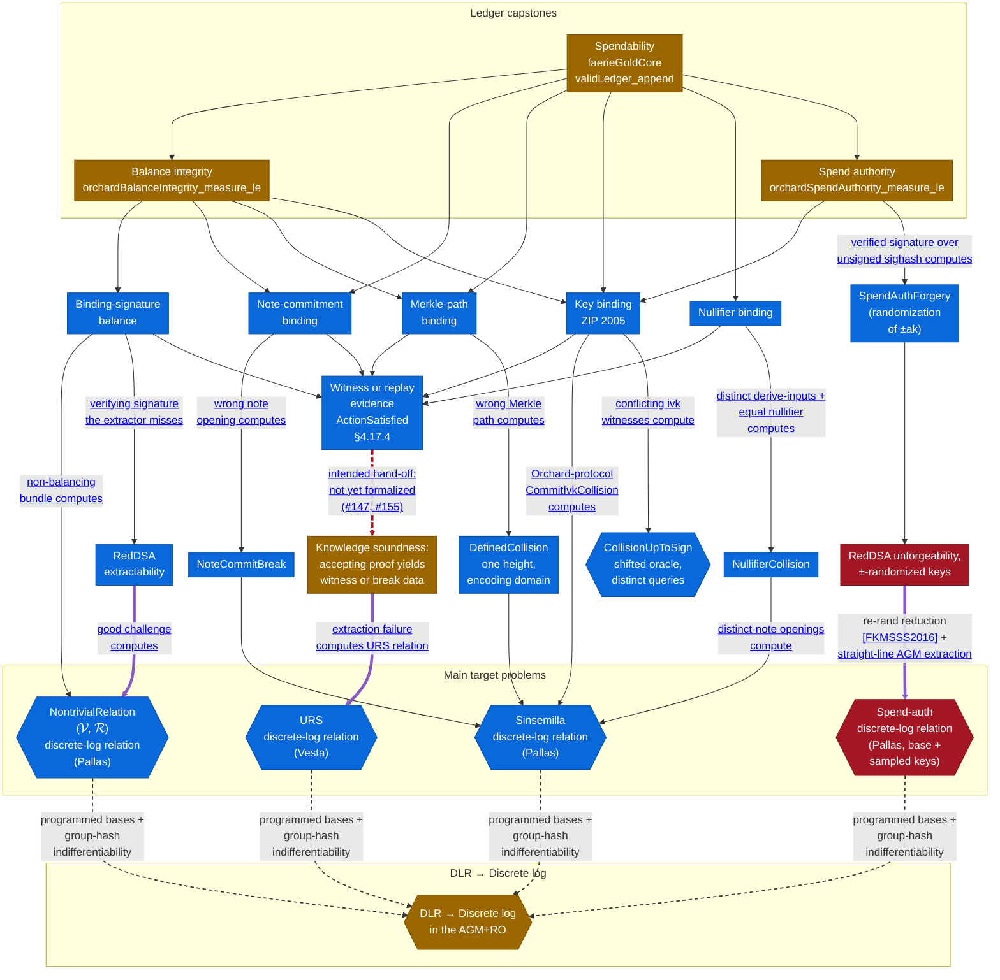

# Ledger Security Games

The [proof map](proof-map.md) traces *verifier knowledge soundness* — the deployed Halo 2 verifier
under `Zcash/Snark/`. This page is its companion for the other half of the development: the
protocol **security properties** under `Zcash/Security/`. It covers:
* the top-level capstones — the *ledger-model security games* of *Balance integrity*, *Spendability*, and *Spend authority*;
* how each capstone connects, by reduction via intermediate security properties such as
  *binding-signature balance* and *key binding*, to an exhibited break of a cryptographic
  primitive in a specified adversary model — and where the intended hand-off to *verifier
  knowledge soundness* remains open.

Every argument here follows the *breaks as computed data* convention and the layered
stack described in [Security Models](security-models.md).

## One picture, not yet connected

➞ Heavy purple edge: a reduction (or intended reduction) in the AGM+RO — the adversary is <a href="security-models.html#the-algebraic-adversary-restriction">algebraic</a> and the challenge oracle is a random oracle that the reduction may program. 
⇢ Dashed red edge: an intended hand-off that is not yet formalized — the endpoints share no definition. (<a href="https://github.com/zcash/ironwood/issues/147">#147</a>, <a href="https://github.com/zcash/ironwood/issues/155">#155</a>) 
➝ Thin edge: depends on (a reduction, assumption, or model). 
⇢ Thin dashed edge into the "DLR → Discrete log" layer: the optional conversion from a nontrivial discrete-log relation to a plain discrete log. Programmed bases (Jaeger–Tessaro),
<a href="group-hash-indifferentiability.html">group-hash indifferentiability</a>, and the
<a href="group-hash-indifferentiability.html#the-first-ingredient-regularity">Weil bound</a> are used
here, and nothing outside that box depends on them. 

 ■  Fully proven — nothing here yet. 
 ■  Stated and machine-checked in Lean, over abstract primitives. 
 ■  Partly machine-checked. The remainder is tracked: discharging the capstones' named ε's end to end (composing the per-arm oracle-model discharges into one experiment); RedDSA unforgeability; knowledge soundness's circuit-correctness conditions; assembling the DLR → DL conversion from its machine-checked halves (Jaeger–Tessaro programmed bases; group-hash indifferentiability under the named Weil hypothesis). 
 ■  Named hypothesis; formalization deferred. 

## What the Balance capstones assume

The Balance capstones are stated for a *Knowledge-Soundness-idealized* adversary
([`IdealizedKSBalanceAdversary`](https://github.com/zcash/ironwood/blob/main/Zcash/Security/Ledger/OrchardIntegrityExperiment.lean)):
one that outputs a witness-annotated ledger, every Action carrying the witness for the
Action statement. The annotation is where knowledge soundness of the Action circuit enters:
nothing yet connects an accepting Halo 2 proof to those witnesses, so the `idealizedks` in
the capstones' names marks results that are complete over this idealized ledger model but
not yet composed with the circuit layer. That composition is the dashed red edge above
([#147](https://github.com/zcash/ironwood/issues/147)); until it lands, the Balance
integrity node stays amber even though every ledger-side arm is machine-checked. This is an
incompleteness of the proof, not an accepted modelling trade-off. The capstones' accepted
trade-offs —the binding challenge hash as a random oracle and elided byte encodings— are
documented at `IdealizedKSBalanceAdversary.violationEvent`. The value and binding bases
are the deployed ones: the conservation arm's target is a discrete-log relation over
those bases, not reprogrammed stand-ins for them.

This picture is a deliberate approximation, and is likely to change as the formalization
proceeds. The "RedDSA unforgeability" node is a named hypothesis rather than a terminal
assumption: its discharge edge names the reduction for security of signatures with
re-randomizable keys
([Efficient Unlinkable Sanitizable Signatures from Signatures with Re-Randomizable Keys](https://eprint.iacr.org/2015/395),
section 3), adapted to the ±-randomized variant, together with the same straight-line
AGM+ROM extraction of Fuchsbauer–Plouviez–Seurin
([Blind Schnorr Signatures and Signed ElGamal Encryption in the Algebraic Group Model](https://eprint.iacr.org/2019/877),
Theorem 1) that discharges the "RedDSA extractability" node at
$(q_H + 2)/\FieldSize + \varepsilon_{\mathrm{DLR}}$, where $\varepsilon_{\mathrm{DLR}}$
is the advantage against the $(\mathcal{V}, \mathcal{R})$ relation. The planned
discharge is to simulate
the signing oracle by programming the challenge oracle at the re-randomized key; the
randomizer, carried by the forgery, enters the extraction as a known coefficient. This
differs from the "RedDSA extractability" node in that the latter has no signing oracle to
simulate, because the signature extracted from is the adversary's own.

Every solid arrow reads "rests on"; where an edge carries a label, the label names the
computed break object flowing along it. Heavy purple arrows mark reductions (or intended
reductions) in the AGM+RO: both the source and the target of such an edge are interpreted
as games against online-AGM adversaries with the challenge oracle as a programmable
random oracle, so the model scopes the whole reduction rather than being one more
assumption it rests on — see
[Security Models](security-models.md#the-algebraic-adversary-restriction).

The "Main target problems" cluster is where the
protocol-specific reductions stop: per-curve discrete-log relations at the deployed
fixed bases, with the sampled spend-authorization keys joining the basis for Spend
authority. The reasons for splitting the "DLR → Discrete log" conversion into a separate
layer are covered [on the Security Models page](security-models.md#the-layered-organization).

The `CollisionUpToSign` arm is terminal without any assumption — its bound is the
birthday count over the oracle table, a pure counting argument. It is the one purely
random-oracle reduction on this page, and it belongs to the ZIP 2005 recovery analysis
rather than the pre-quantum story. The games are the top-level capstones.

As stated above, the KS-idealized ledger model requires the adversary to supply, along
with any accepting proof, a **witness or replay evidence** for the Action statement
(`ActionSatisfied`) — in the replay case the ledger oracle can produce the previously
supplied witness. Each component argument consumes the statement's satisfaction
*on that witness*. Knowledge soundness is what is *intended* to justify that modelling:
whenever the ledger layer needs a witness, the extractor would compute one —or compute
break data— from the accepting proof. That hand-off is not yet formalized in any form:
the games state `ActionSatisfied` over their own abstract types, and no definition is
shared with the SNARK development. The dashed red edge marks exactly this gap
([#147](https://github.com/zcash/ironwood/issues/147),
[#155](https://github.com/zcash/ironwood/issues/155)). Until it lands, the
witness-supply requirement is a modelling assumption of the ledger games, not a
consequence of verifier knowledge soundness.

New to the shorthand? See the [**Definitions**](definitions.md). &nbsp;·&nbsp; For the methodology, [**Security Models**](security-models.md). &nbsp;·&nbsp; For the verifier-soundness half, the [**Proof Map**](proof-map.md).
