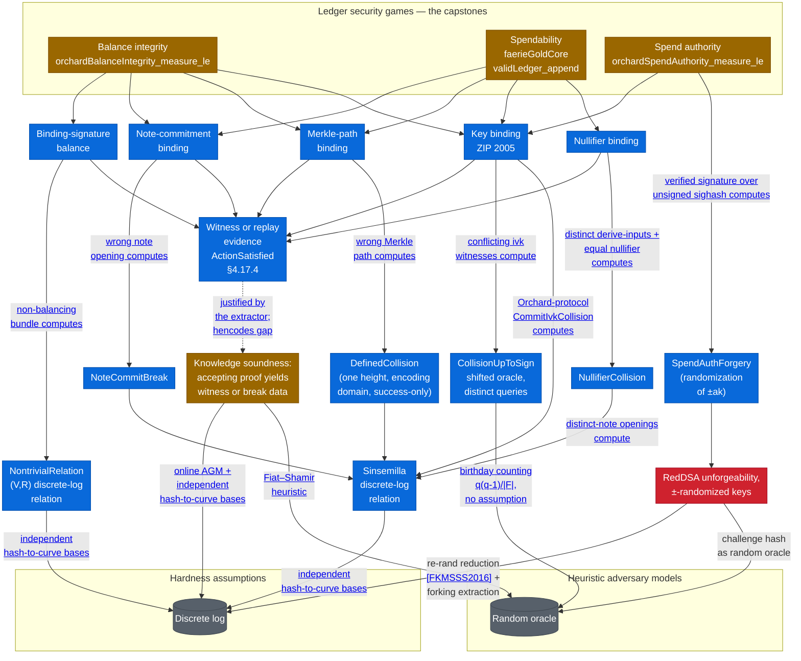

# Security Definitions

The [proof map](proof-map.md) traces *verifier soundness* — the deployed Halo 2 verifier
under `Zcash/Snark/`. This page is its companion for the other half of the development: the
protocol **security properties** under `Zcash/Security/` — binding-signature *balance*, *key
binding*, and the *ledger-model security games* — and how each one connects, by reduction,
to a primitive hardness assumption and to the verifier-soundness proof.

Every argument here has the same shape, the development-wide
[*breaks as computed data*](../formal-verification.md#breaks-as-computed-data) convention:

> A security property, if violated, **exhibits** a concrete break of an underlying
> primitive — a discrete-log relation, a hash collision, a commitment-opening collision —
> computed as data. Hardness is assumed only at the computational layer, against the
> exhibited break.

So each definition sits on a three-layer stack:

- **Layer A — vocabulary.** The break events, as structures carrying their data
  (`RandomOracle.Collision`, `NontrivialRelation`, `NoteCommitBreak`). Deterministic; no
  probability.
- **Layer B — reduction.** A computable `def` that turns a property violation into a
  Layer-A break (`NontrivialRelation.ofImbalance`, `Merkle.collisionOfWrongLeaf`,
  `noteCommitBreakOfNe`). Deterministic; no hardness assumption.
- **Layer C — probability.** The bound that producing the break is hard: the birthday bound
  `q(q-1)/|F|`, or the discrete-log advantage. The only layer that consumes an assumption.

## One connected picture

■ fully proven — nothing here yet 
■ stated and machine-checked in Lean, over abstract primitives 
■ partly machine-checked; remainder tracked (discharging the capstones' named ε's end to end: the key-binding oracle connection, the binding-signature extractability, RedDSA; knowledge soundness's <code>hencodes</code> bridge) 
■ named hypothesis; formalization deferred 
■ assumption or heuristic model; terminal by design

This picture is a deliberate approximation, and is likely to change as the formalization
proceeds. The RedDSA node is a named hypothesis rather than a terminal assumption: its
discharge edge names the reduction for security of signatures with re-randomizable keys
[<a href="https://eprint.iacr.org/2015/395">FKMSSS2016</a>, section 3], adapted to the
±-randomized variant, together with forking extraction of the Schnorr witness.

Every solid arrow reads "rests on"; where an edge carries a label, the label names the
computed break object flowing along it, or the adversary model or side condition under which
the reduction holds (the AGM restriction, base independence from hash-to-curve, the birthday
count). The games are the top-level capstones. The ledger model requires the adversary to
supply, along with any accepting proof, a **witness or replay evidence** for the Action
statement (`ActionSatisfied`) — in the replay case the ledger oracle can produce the
previously supplied witness. Each component argument consumes the statement's satisfaction
*on that witness*. Knowledge soundness is what justifies the modelling: whenever the ledger
layer needs a witness, the extractor computes one —or computes break data— from the accepting
proof. The dashed edge marks that justification, which crosses the `hencodes` gap — "gate
satisfaction implies the intended high-level statement". The latter is the subject of the
circuit soundness proof.

## The definitions

<section>

Binding-signature balance — value preservation

balanceSecurity.BindingSignature.Balance

No transaction creates or destroys value (spec §4.13 Sapling / §4.14 Orchard). Value commitments are <code>cv v rcv = v • V + rcv • R</code>; a bundle's binding verification key collects to <code>bvk = A • V + B • R</code> with <code>A</code> the net value imbalance. The property is <em>not</em> "no discrete-log relation between <code>V</code> and <code>R</code> exists" — one always does in a prime-order group — but the reduction below.

NontrivialRelationBindingSignature.NontrivialRelation · .ofImbalance

The break, as computed data: a nontrivial <code>F</code>-linear relation between the value base <code>V</code> and randomness base <code>R</code>. <code>ofImbalance</code> (and the bundle forms <code>ofBundleModImbalance</code>, <code>ofOrchardImbalance</code>, <code>ofSaplingImbalance</code>) computes one from a non-balancing verifying bundle, with no cryptographic hypothesis — equivalently the discrete log <code>dlog_R V</code> (<code>imbalance_yields_discrete_log</code>).

integer no-overflow liftintBalance_eq_zero_of_lt · orchard_natAbs_lt · sapling_natAbs_lt

Lifts field balance (<code>A = 0</code> in <code>ZMod r</code>) to integer balance: with per-action 64-bit value ranges and a bounded action count, <code>|A| &lt; r</code>, so the residue being zero forces the integer to be zero. Discharged per pool from the value-type subranges.

reduces to DLSnark.Soundness.AGM.BindingSignature

Turns the computed Orchard/Sapling relations into plain discrete-log solutions: <em>if you can unbalance, you can solve DL</em>. DLR and DL are tightly equivalent (Jaeger–Tessaro, <a href="https://eprint.iacr.org/2020/1213">2020/1213</a>, Lemma 3), so this assumes no more than DL hardness, given the independence of the hash-to-curve bases.

</section>

<section>

Key binding — ZIP 2005 theorem (ROM)

key bindingSecurity.KeyBinding.KB

A verifying Recovery-Statement witness pins its key components — <code>ak</code> (up to y-sign), <code>nk</code>, and the <code>qk</code>/<code>sk</code> branch with its key — to <code>ivk</code>, unless a break is exhibited (<a href="https://zips.z.cash/zip-2005#thm-key-binding-rom">ZIP 2005 key-binding theorem</a>). Factors as <code>KB = KBOpening ∧ KBDerivation</code>: the <code>Commit^ivk</code> opening and the derivation constraints.

commit_scalar_pmKeyBinding.commit_scalar_pm · OpeningBreak

Algebraic core: two openings of the same <code>Commitivk</code> value force their Pedersen scalars equal or negated. An <code>OpeningBreak</code> (two valid openings differing in the opening data) is the break structure the games layer produces.

reduces to an RO collisionCollisionUpToSign.ofBreak · Birthday.birthday_closed_form

The reduction computes a <code>±</code>-collision of the <code>rivk</code>-derivation random oracle at distinct derivation queries from a break (Layer B). Producing that collision within <code>q</code> queries is bounded by the birthday bound <code>ε_kb ≤ q(q-1)/|RIVK|</code>, which is <code>q(q-1)/r_ℙ</code> at the intended Pallas instantiation (Layer C).

</section>

<section>

Ledger-model games — the abstract Action statement

Action statement satisfiedSecurity.Ledger.ActionSatisfied

The games-relevant conjuncts of an Orchard-shaped Action statement (spec §4.17.4) over abstract primitives: commitment integrity, Merkle-path validity, nullifier integrity, the key-binding condition, address integrity, value-commitment integrity. This is the interface the games consume, and the target the verifier-soundness proof is meant to deliver.

pinning lemmasivk_pinned · nk_eq_or_break · nf_old_eq_or_break

The deterministic steps of the Balance argument: an address <code>(g_d, pk_d)</code> determines <code>ivk</code> (needs only <code>g_d ≠ 0</code> and torsion-freeness), hence <code>nk</code> is determined up to an exhibited key-binding break, and spends of the same note tuple reveal the same nullifier up to a break.

NoteCommitBreakLedger.NoteCommitBreak · noteCommitBreakOfNe

A note-commitment opening collision, as data. <code>noteCommitBreakOfNe</code> computes one when an <code>extract</code>-equal commitment fails to pin the note tuple <code>(rcm, note)</code>. Prequantumly, note-commitment binding reduces to a Sinsemilla / discrete-log-relation break.

Merkle position bindingLedger.Merkle.collisionOfWrongLeaf

Fixed-depth Merkle trees are position-binding up to a hash collision: a validating authentication path for a leaf that is <em>not</em> the committed one, against a defined tree, computes a <code>DefinedCollision</code> of one height’s compression — escaped (⊥) evaluations never count as collisions. The vector-commitment property the Balance and Spendability arguments require of the note-commitment tree. Prequantumly, the Sinsemilla compression’s collision resistance reduces to a discrete-log-relation break (SDLR) — the same terminal as note-commitment binding — so BLAKE2b collision resistance does not enter the pre-quantum Balance argument.

</section>

<section>

Probabilistic capstones · Ledger/Capstone + Ledger/OrchardCapstone

Balance integrityModel.balanceIntegrityOrBreak · balanceIntegrityPerTxViolation

The shielded pool is non-negative and the pools sum to the minted issuance. The deterministic <code>balanceIntegrityOrBreak</code> proves it up to a computed break; the probabilistic violation events mirror its conclusion (the transparent conjunct cannot fail on the valid sample space). The interval consequence <code>pool ∈ [0, issuanceTotal]</code> is weaker, and survives as the separate shielded-balance-cap capstones.

events as branch preimagesModel.balanceSubsetBreakEvent · txBalanceBreakEvent

An adversary is a <code>PMF</code> over valid annotated ledgers; each event is "the computed reduction lands in this branch on this sample", so no choice is needed to extract break data. Violation events are contained in unions of break events, and each break event's probability is a named ε hypothesis.

all-prefixes bounds, no factor of kModel.balanceIntegrity_measure_le · *Before / *UpTo

One ε per shared break event bounds the violation at <em>every</em> prefix below a bound, where a naive union bound would pay <code>k · ε</code>. Prefix-indexed value events are named <code>*Before</code> and step-indexed Balance-subset events <code>*UpTo</code> (EWD 831 half-open ranges, exclusive bound as the parameter); the one step/prefix crossing is confined to <code>_succ</code>-marked lemmas.

the Orchard single-ε collapseBridge.orchardRelationEvent · orchardBalanceIntegrity_measure_le

At the Orchard-protocol bases, every Balance-subset arm's break computes a nontrivial discrete-log relation among the fixed Sinsemilla bases, so one <code>ε_sinsemilladlr</code> replaces the three per-arm ε's — and every prefix lands in the same relation event, so the all-prefixes bounds cost no factor of <code>k</code>. <code>ε_sinsemilladlr</code> reduces tightly to discrete-log hardness (Jaeger–Tessaro, <a href="https://eprint.iacr.org/2020/1213">2020/1213</a> Lemma 3, re-proved as <code>relation_prob_le_of_textbookDL</code>); the witness-level model abstracts away Halo 2 knowledge soundness, a separate, lossy reduction on the different Halo 2 bases. <code>ε_bindsig</code> names the bound on the conservation side (intended binding-signature discharge: <a href="https://github.com/zcash/ironwood/issues/107">#107</a>, <a href="https://github.com/zcash/ironwood/issues/22">#22</a>).

</section>

<section>

Shared foundation · Zcash/Security/Common

collision vocabularySecurity.RandomOracle.Collision · CollisionUpToSign

Layer-A break events for the classical ROM: a <code>Collision</code> is two distinct queries with equal outputs; a <code>CollisionUpToSign</code> (<code>a =± b</code>) is the shape produced by arguments passing through the <code>Extract</code> coordinate extractor, whose fibres are <code>{P, −P}</code>. Key binding bottoms out here, as does the nullifier (Faerie-Gold) argument for the Recovery Statement; the deployed nullifier argument bottoms out in the Sinsemilla discrete-log relation instead.

birthday boundSecurity.Birthday.birthday_closed_form

The Layer-C probability: the shifted <code>±</code>-collision event over <code>q</code> uniform oracle outputs has probability at most <code>q(q-1)/|F|</code>, by union-bounding the per-pair fraction <code>2/|F|</code>. Counted in the random-oracle model with no hardness assumption; proven as a probability statement over the uniform oracle table (#73).

</section>

New to the shorthand? See the [**Glossary**](glossary.md). &nbsp;·&nbsp; For the verifier-soundness half, the [**Proof Map**](proof-map.md).
